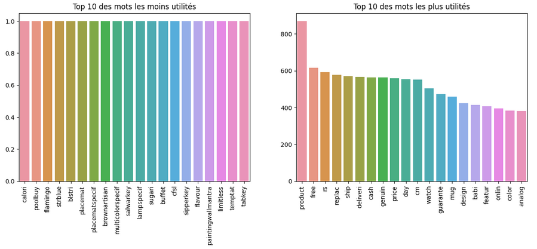
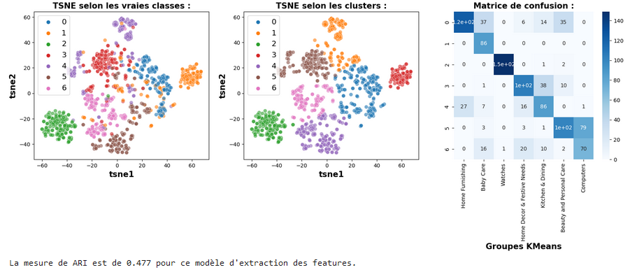
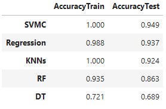
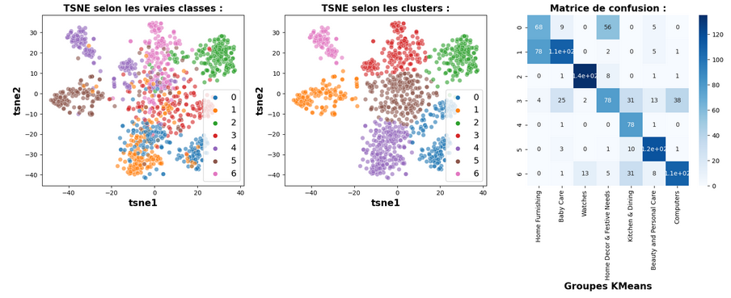
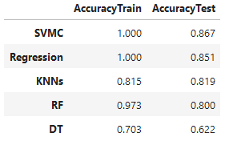
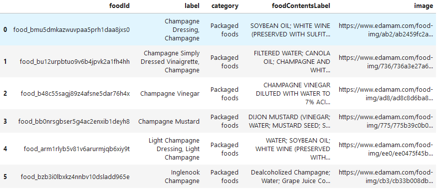

# Product-Classification-NLP-CV-2023

Projet réalisé en 2023 dans le cadre de ma formation en Data Science.  
Objectif : classifier automatiquement des biens de consommation à partir de leurs **descriptions textuelles** et **images**, pour aider une place de marché à mieux organiser ses produits et automatiser le travail des vendeurs.

## Objectifs

- Automatiser l’attribution des catégories produits
- Évaluer les performances de différents modèles basés sur le texte (NLP) et les images (Computer Vision)
- Tester l’enrichissement via des APIs externes

## Données

- **Source** : [Dataset produit](https://s3-eu-west-1.amazonaws.com/static.oc-static.com/prod/courses/files/Parcours_data_scientist/Projet+-+Textimage+DAS+V2/Dataset+projet+pre%CC%81traitement+textes+images.zip)

Contenu :
- Descriptions produits textuelles
- Images produits
- Catégories associées à prédire

## Méthodologie

### 1. Prétraitement des données

- Nettoyage des textes : tokenisation, stopwords, ponctuation, stemming, lemmatisation
- Exploration de la longueur des textes  
    
  

### 2. Classification basée sur le texte (NLP)

- **Représentations utilisées** : CountVectorizer, TF-IDF, Word2Vec, BERT, USE
- **Modèles de classification** : plusieurs algorithmes supervisés testés
- **Visualisations** : t-SNE + KMeans + matrices de confusion  
    
  

### 3. Classification basée sur les images

- **Techniques** : SIFT, CNN avec transfert learning
- **Modèles évalués** via t-SNE, KMeans, matrices de confusion  
    
  

### 4. Intégration d'une API externe

- **API utilisée** : [Edamam – Food & Grocery](https://rapidapi.com/edamam/api/edamam-food-and-grocery-database)
- **Objectif** : enrichir les prédictions avec des données externes

  Exemple de produit : champagne  
  

## Résultats

- **Performances mitigées**, en partie à cause du manque de diversité dans les données
- La combinaison **texte + image** reste prometteuse pour une classification plus robuste
- L’usage d’une **API externe** peut enrichir le modèle ou aider à la validation

## Technologies utilisées

- **Langage** : Python
- **Librairies** : pandas, seaborn, matplotlib, scikit-learn, Keras, TensorFlow, PIL, numpy, requests
- **Approches** : NLP, Computer Vision, Clustering, Classification supervisée, API Integration

## Contact

Projet réalisé en 2023 dans le cadre d’une formation en Data Science.  
Pour toute remarque ou suggestion :

- **Email** : [johan.rocheteau@hotmail.fr](mailto:johan.rocheteau@hotmail.fr)  
- **LinkedIn** : [linkedin.com/in/johan-rocheteau](https://www.linkedin.com/in/johan-rocheteau)

